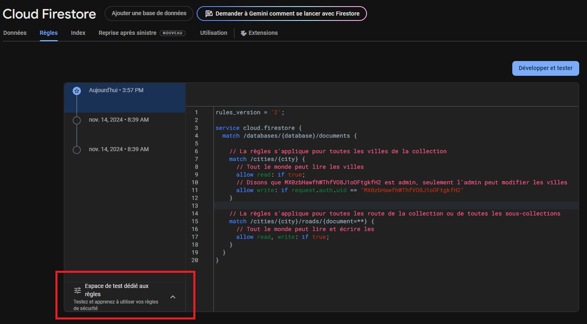
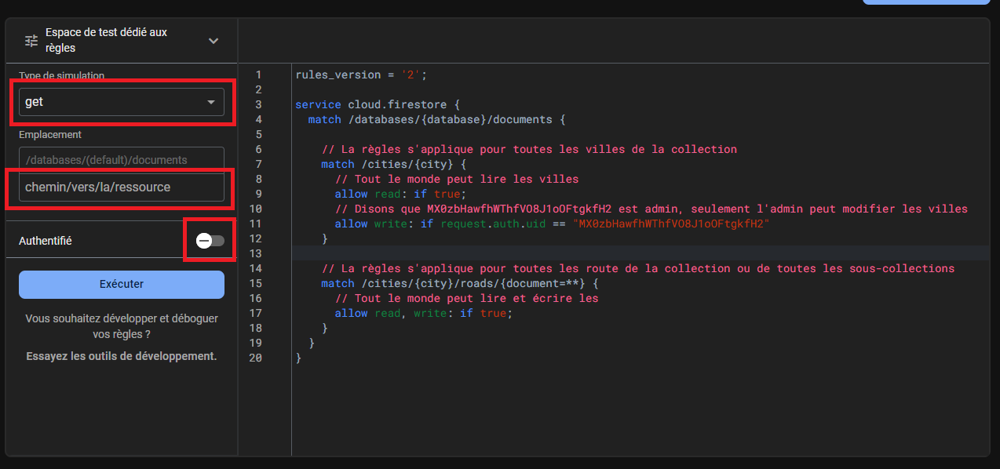
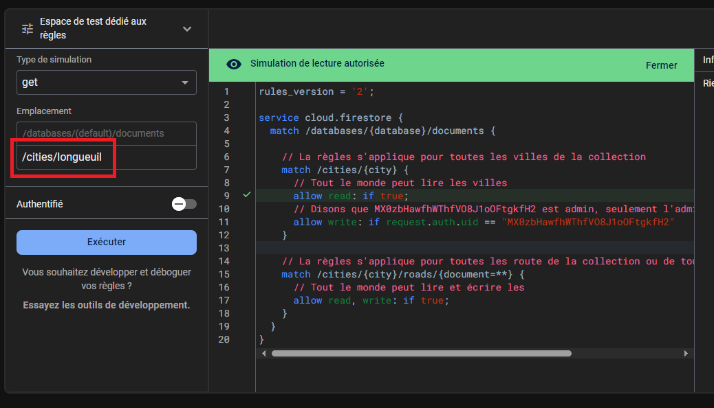
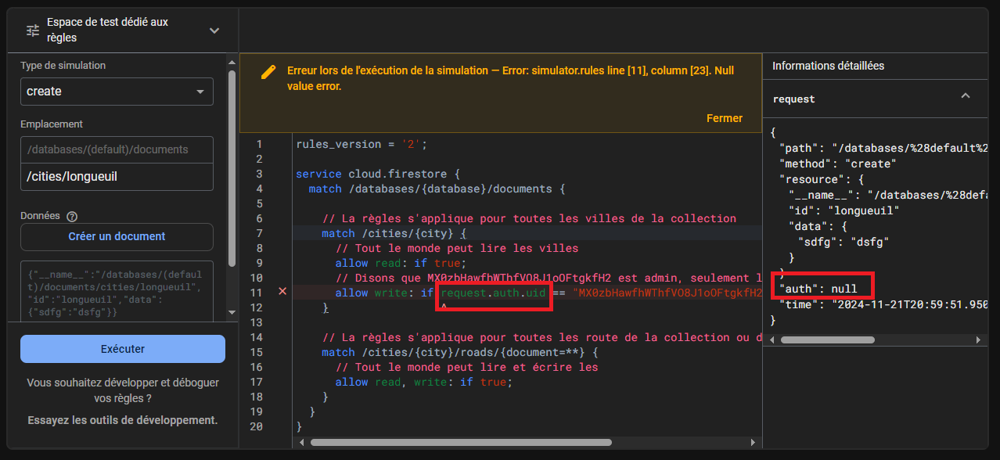
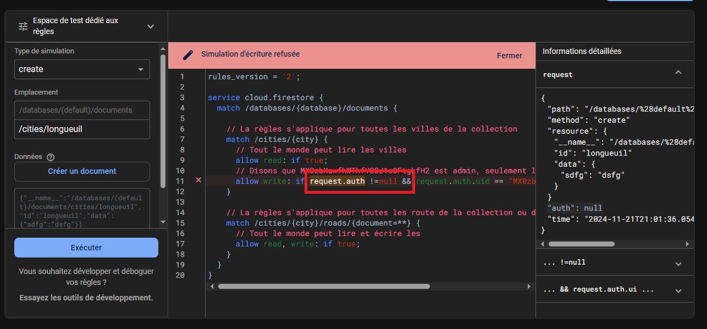
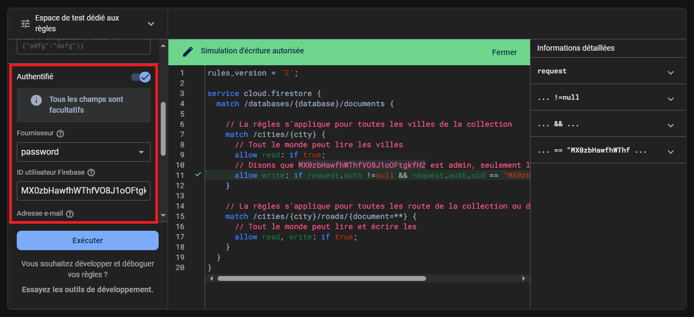
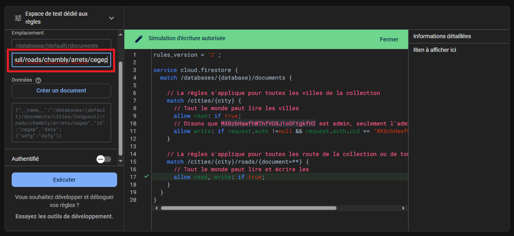
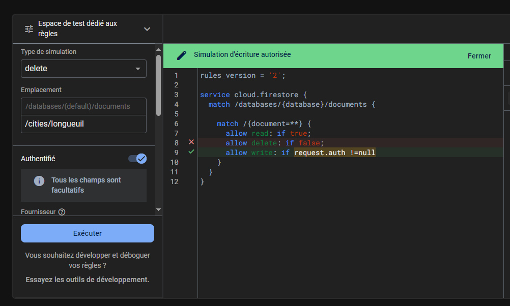
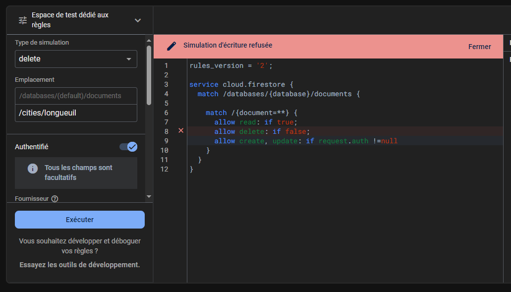

# Flutter Règles d'accès Firebase 

### Règles de base à la création

À la création de votre DB Firestore, vous avez des règles d'accès qui ressemblent à ceci
```js title="Version de Test"
rules_version = '2';

service cloud.firestore {

  match /databases/{database}/documents {

    match /{document=**} {
      allow read, write: if request.time < timestamp.date(2024, 12, 14);
    }
  }

}​​​​​​​​
```

### Structure des règles

```js title="Stucture de base"
rules_version = '2';

service cloud.firestore {​​​​​​​​
  match /databases/{​​​​​​​​database}​​​​​​​​/documents {​​​​​​​​

    //TODO l'instruction match sert à ajouter une règle d'accès
    match /<some_path>/ {​​​​​​​​
      //TODO on choisi ensuite le niveau de droit qu'on permet basé sur une condition
      allow read, write: if <some_condition>;
    }​​​​​​​​

  }​​​​​​​​
}​​​​​​​​
```

```js title="Exemple d'utilisation"
rules_version = '2';

service cloud.firestore {
  match /databases/{database}/documents {

    // La règles s'appliquent pour toutes les villes de la collection
    match /cities/{city} {
    	// Tout le monde peut lire les villes
      allow read: if true;
      // Disons que MX0zbHawfhWThfVO8J1oOFtgkfH2 est admin, seulement l'admin peut modifier les villes
      allow write: if request.auth.uid == "MX0zbHawfhWThfVO8J1oOFtgkfH2"
    }
    
    // La règles s'appliquent pour toutes les routes de la collection ou de toutes les sous-collections
    // {document=**} est un wildchar qui permet d'appliquer la règle à tous les documents de façon récursive
    match /cities/{city}/roads/{document=**} {
    	// Tout le monde peut lire et écrire
      allow read, write: if true;
    }
  }
}
```

### Tester nos règles

<Row>
  - On peut également utiliser l'espace de test pour valider nos nouvelles règles
  <Column size="12">
    
  </Column>
  - On peut choisir le type d'opération à tester, le chemin vers le document qu'on voudrait accéder et l'authentification de l'utilisateur
  <Column size="12">
    
  </Column>
  - Ici, on valide l'accès en lecture au document "Longueuil" dans la collection de villes pour tous les utilisateurs
  <Column size="12">
    
  </Column>
  - On valide maintenant l'accès mais cette fois si en écriture
  - On remarque une erreur dans les règles, l'objet request.auth est null, donc request.auth.uid donne "Null value error"
  <Column size="12">
    
  </Column>
  - On corrige le tout pour relancer la validation
  <Column size="12">
    
  </Column>
  - On ajoute un utilisateur pour valider les droits "admin"
  <Column size="12">
    
  </Column>
  - Finalement, on test l'accès à toutes les sous-collections
  <Column size="12">
    
  </Column>
  
</Row>

### Valider qu'un utilisateur est connecté

Les informations de connexions de l'utilisateur se trouve dans l'objet request.auth

```js title="Permettre la lecture à tous mais l'écriture seulement aux utilisateurs connectés"
rules_version = '2';

service cloud.firestore {​​​​​​​​
  match /databases/{​​​​​​​​database}​​​​​​​​/documents {​​​​​​​​

    match /{document=**} {
      // Tout le monde peut lire
      allow read: if true;
      // On doit être connecté pour écrire (CREATE, UPDATE, DELETE)
      allow write: if request.auth !=null
    }

  }​​​​​​​​
}​​​​​​​​
```


### Plusieurs règles sur un même document

- Il est possible que plusieurs règles s'applique sur un même document
- Dès qu'une règle a la valeur **true**, l'accès est accordé
<Column size="12">
  
</Column>
- Ici, si l'on veut vraiment interdire la suppression, il faudra être plus précis
<Column size="12">
  
</Column>


### Ajouter une "variable" / paramètre

#### Match avec un document par le id

```js title="Utiliser un paramètre dans la route"
rules_version = '2';

service cloud.firestore {​​​​​​​​
  match /databases/{​​​​​​​​database}​​​​​​​​/documents {​​​​​​​​

    // {userid} crée un paramètre pour notre règle
    // Ça fonctionne un peu comme une route en ASP.Net
    match /users/{userid} {
      // Seulement l'utilisateur lui-même peut avoir accès à ses données
      allow read, write: if request.auth !=null && request.auth.uid == userid
    }

  }​​​​​​​​
}​​​​​​​​
```

#### Match avec un document par valeur d'un champ

- Pour valider avec un champ, on doit aller lire le document
- On peut lire un champ avec la méthode **get(path)**

```js title="Récupérer un document"
rules_version = '2';

service cloud.firestore {​​​​​​​​
  match /databases/{​​​​​​​​database}​​​​​​​​/documents {​​​​​​​​

    match /users/{user} {
      // Seulement un utilisateur avec le rôle admin peut avoir accès aux utilisateurs
      allow read, write: if get(/databases/$(database)/documents/users/$(request.auth.uid)).data.role == "admin";
    }

  }​​​​​​​​
}​​​​​​​​
```

- Comme que ça peut faire de longues conditions, on peut faire des fonctions
```js title="Faire des fonctions"
rules_version = '2';

service cloud.firestore {​​​​​​​​
  match /databases/{​​​​​​​​database}​​​​​​​​/documents {​​​​​​​​

    // On crée une fonction pour valider que l'utilisateur connecté est un admin
    function isAdmin() {
    	return get(/databases/$(database)/documents/users/$(request.auth.uid)).data.role == "admin";
    }

    match /users/{userid} {
      // On utilise notre fonction
      allow read, write: if isAdmin();
    }

  }​​​​​​​​
}​​​​​​​​
```